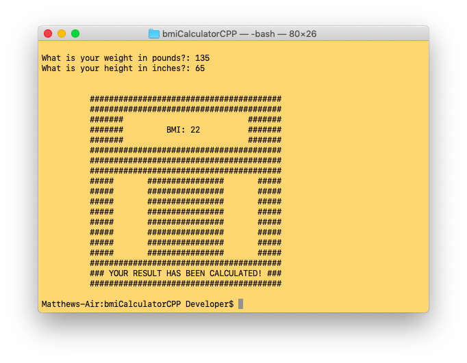

# **BMI Calculator**

## Credits

©2019 Matthew Farmer

## About

BMI Calculator is a command line application written in C++. Users can enter their weight (in pounds) and height (in inches) to see what their current Body Mass Index (BMI) is.

## Walkthrough

### Start

To compile: ` make bmiCalculator`

To run: ` ./bmiCalculator`

Assuming that the program has been compiled, users can run the program by typing  ` ./bmiCalculator` in the terminal and pressing Enter. The application will then prompt the user to provide a weight and height value.

### Example

In the example below, the user provided values for both height and weight. The calculated BMI is displayed to the user on a virtual scale.

## Technologies Used

This application is written in C++.
